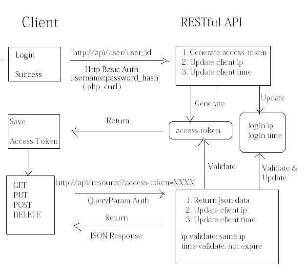

@(yii2)

A Solution for Yii2 RESTful API Auth
===

use the demo
---
>Though here my client and server(api) are the same project, both `http://192.168.4.126 (inner ip)` , realized by Yii2 Framework
> the logic are separated, and you can split client side out and realize it with other frameworks even other languages

Steps:
1. http://192.168.4.126/site/login and login, you'll get an `access-token`, 123 for example
2. http://192.168.4.126/news?access-token=123 for response data, with in 10 seconds and do not change your ip
3. 10 seconds expire time can be configed in `yii/config/params.php`
4. other http methods are alse supported, docs on http://xxx.apiary.io/



1. Client Login
2. Client curl for `access-token`
3. Server Authenticate Request under Http Basic Auth
3. Server Generate `access-token`
4. Client Request for resource data
5. Server Authenticate Request under QueryParam Auth & validate login ip/time
6. Server Update Login ip/time after response data

user table structure:
---
```
mysql> select * from user where username = 'ganiks'\G;
*************************** 1. row ***************************
                  id: 1
            username: ganiks
            auth_key: iuMVI8x2bvrcdpZ*****dmcLmIt5WgI
       password_hash: $2y$13$06XKlh09ZOwd5s*****u3swIdPPDlRyJQp8z19CIl6xeQvgD3wu
password_reset_token: NULL
               email: ganiks@qq.com
                role: 10
              status: 10
          created_at: 1406096791
          updated_at: 1408686097
        access_token: WXU0M1M4ckdx*****azlnYWhLdHgw
     last_login_time: 2014-08-22 13:41:37
       last_login_ip: 192.168.4.126
1 row in set (0.00 sec)
```

1. Client Login
---
```
    $model = new LoginForm();
    if ($model->load(Yii::$app->request->post()) && $model->login()) {
		$model->requestForAccessToken();
    }
```

2. Client curl for `access-token`
---
```
	public function requestForAccessToken()
	{
		/*
		 * with username and password to login apiHost for user/id's access_token
		 * after the basic authentication 
		 * token will be generated at the api server end
		 */
		$username = $this->_user->username;
		$password = $this->_user->password_hash;
		$id = $this->_user->id;
		$apiHost = Yii::$app->params['restapi']['apiHost']; 

		$ch = curl_init();
		curl_setopt($ch, CURLOPT_URL, $apiHost.'/users/'.$id);
		curl_setopt($ch, CURLOPT_RETURNTRANSFER, TRUE);
		curl_setopt($ch, CURLOPT_HEADER, FALSE);
		curl_setopt($ch, CURLOPT_USERPWD, $username.':'.$password);
		$response = curl_exec($ch);
		curl_close($ch);
		$user = json_decode($response);
		print_R($user->access_token);exit;
	}
```

> here, client can save the `access-token` into cookie or somewhere else

3. Server Authenticate Request under Http Basic Auth
---
```
    public function authenticate($user, $request, $response)
    {
        $username = $request->getAuthUser();
        $password = $request->getAuthPassword();

        if ($this->auth($username, $password)) {
            if ($username !== null || $password !== null) {
                $identity = $this->auth($username, $password);
                if ($identity !== null) {
                    /**
                    * here, generate access-token and update login ip/time 
                    */
					$identity->updateAccessToken();
                    $user->switchIdentity($identity);
                } else {
                    $this->handleFailure($response);
                }
                return $identity;
            }
        } elseif ($username !== null) {
            $identity = $user->loginByAccessToken($username, get_class($this));
            if ($identity === null) {
                $this->handleFailure($response);
            }
            return $identity;
        }

        return null;
    }
```

3. Server Generate `access-token`
---
####app\models\User2.php
```
	public function updateAccessToken()
	{
        $this->access_token = Yii::$app->security->generateRandomString();
		$this->last_login_time = date('Y-m-d H:i:s', strtotime('now'));
		$this->last_login_ip = Yii::$app->request->userIP;
		$this->save();
	}
```


4. Client Request for resource data
---
```
http://192.168.4.126/news?access-token=WWRoYmxUNHdJSU5kNHo1X0pSTHJEQlo5
```


5. Server Authenticate Request under QueryParam Auth & validate login ip/time
---
```
    public function authenticate($user, $request, $response)
    {
        $accessToken = $request->get($this->tokenParam);
        if (is_string($accessToken)) {
			$identity = $user->loginByAccessToken($accessToken, get_class($this));
			if ($identity) 
			{
				$userIp = Yii::$app->request->userIP;
				$now_time =  strtotime('now');
				$last_login_time = $identity->last_login_time;
				$diff_time = $now_time - strtotime($last_login_time);
				/**
				 * check ip and time
				 */
				if ($userIp == $identity->last_login_ip) 
				{
					if ($diff_time < Yii::$app->params['restapi']['tokenExpire']) 
					{
						return $identity;
					} else {
						throw new UnauthorizedHttpException(Yii::t('yii', 'You are requesting with an expired access token, please request for a new one.'));
					}
				} else {
					throw new UnauthorizedHttpException(Yii::t('yii', 'You are requesting with an access token with a different ip address.'));
				}
			}else{
				$this->handleFailure($response);
			}
		}else{
			throw new UnauthorizedHttpException(Yii::t('yii', 'You are requesting with a wrong-formatted access token.'));
		}
        if ($accessToken !== null) {
            $this->handleFailure($response);
        }

        return null;
    }
```

> so , there 4 kind of response
+ sucess with json data
+ status 401
    + token wrong
    + token expire
    + not the same ip


6. Server Update Login ip/time after response data
---
####app\models\User2.php
```
	public function updateAccessInfo()
	{
		$this->last_login_time = date('Y-m-d H:i:s', strtotime('now'));
		$this->last_login_ip = Yii::$app->request->userIP;
		$this->save();
	}
```

###app\controllers\rest\Action.php
```
	public function afterRun()
	{
		/**
		 * update user's last_login_time and last_login_ip
		 */
		Yii::$app->user->identity->updateAccessInfo();
	}
```


